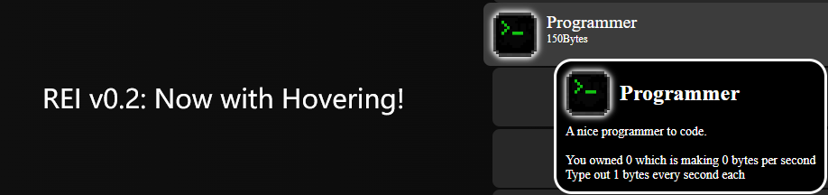

雷猴啊！俺是Likia,最近这个网站被我充满了Javascript(更酷了)还有一个关于[Code Clicker](codeclicker)的大更新！比方说支持鼠标悬停的API还有第二个建筑以及一些生活质量更新，接下来是具体内容

## Code Clicker
- 第二个建筑: 程序员
- 鼠标悬停信息API
- 两个内置更新函数
- bps,bytes算法更改
- 购买建筑现在需要增加15%的价格(累加)
- 键盘图标重绘
- 修复了3个bug

## 网页
- 现可通过[LikiaStudios.com](http://likiastudios.com)访问！
- 不同的博文现共享同一个.css文件
- 在某些页面上修复了一些适配性问题
- 随机主页文本

Enjoy! XD!

后记: 主页的结构其实没被大改