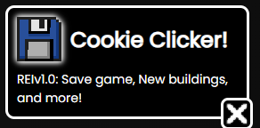

Woo! The third update to the website is finally dropped! I recently gone prepare for the mid term exams and so now im release a TON of updates, also thank you everyone for supporting me to keep me motivated. Now. Here's the complete devlog and series of updated that dropped

- /title Code Clicker
- New Buildings: Crawler and Miner
- Save game! Your game progress can now be saved!
- bps, bytes Algorithm Adjust
- Keyboard and Programmer icon remake
- Notifications popup (but only used by save game lol)
- Removed no save game message in the corner and added a shade to it
- Bug: Lines do not increment by the buildings

The future plans is adding option for you to work on projects, which pause your bytes production and progress it, when done, gives you permanent boost (or switch to turn it on) on features like auto buy, etc. and yeah there will be upgrades. ALSO!!! The most important feature planned is the feature for you to use like Scratch's Drag and Drop code to script your scripts on your own! Next update planned on Nov 18 if things is normal.

- /title Site
- New font form GoOgle f0nts: Poppins (bro this font is so fking beautiful)
- Multiple Languages both in devlogs and the main page
- Indev label for Code Clicker
- Links to my github, bilibili, rick roll (the discord one) and a link to [BaiYuQianXia's bilibili](https://space.bilibili.com/14444480)
- Removed the new domain notifcation, since the original one just redirects to the new one.

Like i actually have something to say to the game industries, which is now some simulator games creators just dump some picture on the internet and they don't really understand art and what things that they should put to the game, like Internet Cafe Simulator(s) and other simulator games, they just put a random money spawning gamble game that can just completely break the game! or just a lot of weird UI and scripts from the tutorials, and their game is like PAID! isn't the game should be free for such a early version of the game? If your game is good, i will want to pay for the game. thats just my opinions, like maybe i do have some misunderstandings and stuff, if your game have 50k$ sales, hire a artist.

Also: when you made a game, do not only update that game and keep pushing out DLCs, go make some new games, if you only have one game and if your main game is ruined and your whole game studio will be done.

And that's it! Enjoy! XD!