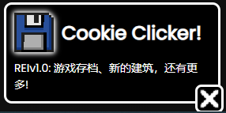

芜湖！网站的第三个更新终于来了！我最近去期中考试了，所以没有多少时间更新网站，我也很感谢那些支持我的人；接下来是具体的更新日志和一些我的感想

- /title Code Clicker
- 新建筑：爬虫和矿机
- 游戏存档！你的游戏数据可以被自动保存了！
- bps, bytes 算法修改
- 键盘和程序员图标修改
- 提醒 (不过只有保存游戏用到了这个功能lol)
- 左下角水印修改
- Bug: 代码行数无法被建筑增加

后面的计划是你可以进行一些项目，不过会暂停你的字节数的增加，当完成时可以给你一些永久的增强效果(或者切换是否开启)比如自动购买之类的；还有升级肯定会有的。 还有！！！最重要的一项更新是你可以通过拖拽来自己编写脚本的功能！如果不出意外的话，下次更新在18号

- /title 网站
- 新的字体: Poppins (卧槽这玩意太好看了吧)
- 在主页和新闻页的多语言
- Code Clicker的开发中标识(返场功能)
- 到我Github,B站,和Discord的连接，还有[白羽千夏的主页](https://space.bilibili.com/14444480)
- 移除了旧域名的提醒，因为反正旧域名会给你重定向到新域名

其实我有几句想跟游戏行业说的话，就是有些游戏开发者他们就会上网上找点不知道哪找来的图片，他们好像根本不懂美术是干什么的还有他们游戏里该放什么东西，比如网吧模拟器(们)还有其他的一些模拟器游戏，里面很多都会在电脑里内置一个可以彻底破坏游戏平衡性的抽奖刷钱小游戏(期望收益>1)，再加上点破烂UI和不知道哪个教程找来的破烂脚本，他们这些游戏甚至都是收费的！你的游戏连基础部分都没搞好呢就想着收费？如果你的游戏做的好的话，我花钱也是心甘情愿(比如加油站模拟器\小偷模拟器2(一代很烂)和冲就完事模拟器)。这些都是我的个人观点，我目前在社会阅历上也不是特别多而且也可能有理解错误，不过如果你的游戏有5万+美刀的销售额的话，去雇个(学点)美术吧

还有一点：当你做出一个游戏以后，不要紧着这一个游戏更新和出DLC，你万一这游戏没了你整个工作室就没了，去做点其他游戏你还能挣更多钱。

差不多就这样了! Enjoy! XD!